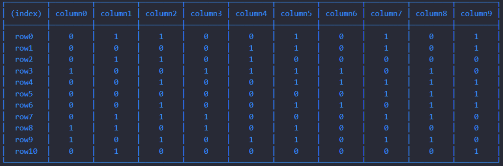

# Week 2 Challenge 5 🦠

El challenge de este fin de semana consiste en reproducir a través de JS el [Juego de la vida de Conway](https://es.wikipedia.org/wiki/Juego_de_la_vida).

| Los requisitos básicos son:                                    |                           Los milestones son: |
| :------------------------------------------------------------- | --------------------------------------------: |
| - [x] Testear con jest                                         |            - [x] Programa funcional con JS 🎊 |
| - [x] Utilizar SonarCloud para comprobar la calidad del código | - [x] Programa ~~100%~~ **99.4%** testeado 😑 |
| - [x] Utilizar Husky para manejar los git-hooks                |   - [ ] Crear un entorno de uso en HTML y CSS |
| - [x] Utilizar GitActions para cumplir el workflow             |                    - [ ] Desplegar en Netlify |
| - [x] Proteger el main para mergear sólo por pull request      |                                               |
| - [ ] Si se llega a HTML/CSS usar BEM y Sass                   |                                               |

## A tener en cuenta

- El archivo app.js contiene el programa entero porque, al intentar separarlo en otros archivos exportando sus funciones e importándolo, me daba error y no conseguí solucionarlo 😶

- Los nombres de los commits no sé si son correctos, ya que a veces me despisto y hago más cosas de las debidas para un solo commit 😅

## Ejemplo del resultado

## Dudas

1. Cómo separar la clase y funciones en archivos separados del app.js.
2. Cómo testear adecuadamente el setInterval, tanto en jest como en sonarCloud.
